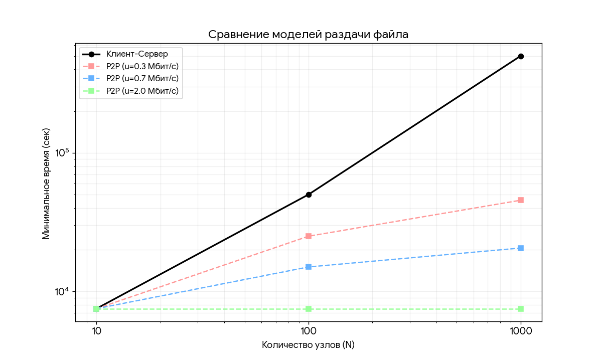

# Практика 5. Прикладной уровень

## Программирование сокетов.

### A. Почта и SMTP (7 баллов)

### 1. Почтовый клиент (2 балла)
Напишите программу для отправки электронной почты получателю, адрес
которого задается параметром. Адрес отправителя может быть постоянным. Программа
должна поддерживать два формата сообщений: **txt** и **html**. Используйте готовые
библиотеки для работы с почтой, т.е. в этом задании **не** предполагается общение с smtp
сервером через сокеты напрямую.

Приложите скриншоты полученных сообщений (для обоих форматов).

#### Демонстрация работы
todo

### 2. SMTP-клиент (3 балла)
Разработайте простой почтовый клиент, который отправляет текстовые сообщения
электронной почты произвольному получателю. Программа должна соединиться с
почтовым сервером, используя протокол SMTP, и передать ему сообщение.
Не используйте встроенные методы для отправки почты, которые есть в большинстве
современных платформ. Вместо этого реализуйте свое решение на сокетах с передачей
сообщений почтовому серверу.

Сделайте скриншоты полученных сообщений.

#### Демонстрация работы
todo

### 3. SMTP-клиент: бинарные данные (2 балла)
Модифицируйте ваш SMTP-клиент из предыдущего задания так, чтобы теперь он мог
отправлять письма с изображениями (бинарными данными).

Сделайте скриншот, подтверждающий получение почтового сообщения с картинкой.

#### Демонстрация работы
todo

---

_Многие почтовые серверы используют ssl, что может вызвать трудности при работе с ними из
ваших приложений. Можете использовать для тестов smtp сервер СПбГУ: mail.spbu.ru, 25_

### Б. Удаленный запуск команд (3 балла)
Напишите программу для запуска команд (или приложений) на удаленном хосте с помощью TCP сокетов.

Например, вы можете с клиента дать команду серверу запустить приложение Калькулятор или
Paint (на стороне сервера). Или запустить консольное приложение/утилиту с указанными
параметрами. Однако запущенное приложение **должно** выводить какую-либо информацию на
консоль или передавать свой статус после запуска, который должен быть отправлен обратно
клиенту. Продемонстрируйте работу вашей программы, приложив скриншот.

Например, удаленно запускается команда `ping yandex.ru`. Результат этой команды (запущенной на
сервере) отправляется обратно клиенту.

#### Демонстрация работы
todo

### В. Широковещательная рассылка через UDP (2 балла)
Реализуйте сервер (веб-службу) и клиента с использованием интерфейса Socket API, которая:
- работает по протоколу UDP
- каждую секунду рассылает широковещательно всем клиентам свое текущее время
- клиент службы выводит на консоль сообщаемое ему время

#### Демонстрация работы
todo

## Задачи

### Задача 1 (2 балла)
Рассмотрим короткую, $10$-метровую линию связи, по которой отправитель может передавать
данные со скоростью $150$ бит/с в обоих направлениях. Предположим, что пакеты, содержащие
данные, имеют размер $100000$ бит, а пакеты, содержащие только управляющую информацию
(например, флаг подтверждения или информацию рукопожатия) – $200$ бит. Предположим, что у
нас $10$ параллельных соединений, и каждому предоставлено $1/10$ полосы пропускания канала
связи. Также допустим, что используется протокол HTTP, и предположим, что каждый
загруженный объект имеет размер $100$ Кбит, и что исходный объект содержит $10$ ссылок на другие
объекты того же отправителя. Будем считать, что скорость распространения сигнала равна
скорости света ($300 \cdot 10^6$ м/с).
1. Вычислите общее время, необходимое для получения всех объектов при параллельных
непостоянных HTTP-соединениях
2. Вычислите общее время для постоянных HTTP-соединений. Ожидается ли существенное
преимущество по сравнению со случаем непостоянного соединения?

#### Решение
1. Время задержки передачи данных равно:  
   $t_{delay} = \dfrac{10}{300 \cdot 10^6} = 33 нс$  
   Запрос и пересылка первого объекта используют всю полосу пропускания, поэтому их время равно:  
   $t_{ctrl-full} = \dfrac{200}{150} + t_{delay} = 1.33 c$  
   $t_{object-full} = \dfrac{100000}{150} + t_{delay} = 666.67 c$  
   Запрос и пересылка каждого из последующих 10 объектов использует 1/10 полосы пропускания, т.е. 15 бит/с, поэтому их время равно:  
   $t_{ctrl-part} = \dfrac{200}{15} + t_{delay} = 13.33 c$  
   $t_{object-part} = \dfrac{100000}{150} + t_{delay} = 6666.67 c$  
   Получение каждого объекта включает время на трехэтапное рукопожание, HTTP-запрос и передачу объекта (HTTP-ответ).  
   Для первого объекта оно равно:  
   $T_{initial} = 4 \cdot t_{ctrl-full} + t_{object-full} = 672 c$  
   Для всех последующих объектов суммарно (т.к. они передаются параллельно):  
   $T_{subsequent} = 4 \cdot t_{ctrl-part} + t_{object-part} = 6720 c$  
   Таким образом, общее время, необходимое для получения всех объектов при параллельных непостоянных HTTP-соединениях, равно:  
   $T = T_{initial} + T_{subsequent} =$ **7392 c**  
2. Для постоянного соединения нужно будет открыть на одно соединение меньше (т.к. первое соединение будет переиспользоваться при пересылке
одного из последующих 10 объектов), поэтому один из 10 параллельных запросов выполнится быстрее, однако остальные 9 будут выполняться за то же время,
что и при непостоянных соединениях. Т.к. общее время параллельных пересылок равно времени самой долгой из них, то оно не изменится, и итоговое время
будет тем же - **7392 c**. Преимущества по сравнению со случаем непостоянных соединений не ожидается.

### Задача 2 (3 балла)
Рассмотрим раздачу файла размером $F = 15$ Гбит $N$ пирам. Сервер имеет скорость отдачи $u_s = 30$
Мбит/с, а каждый узел имеет скорость загрузки $d_i = 2$ Мбит/с и скорость отдачи $u$. Для $N = 10$, $100$
и $1000$ и для $u = 300$ Кбит/с, $700$ Кбит/с и $2$ Мбит/с подготовьте график минимального времени
раздачи для всех сочетаний $N$ и $u$ для вариантов клиент-серверной и одноранговой раздачи.

#### Решение
1. Клиент-сервер:  
Скорость поступления данных на клиенты, если сервер выполняет раздачу всем клиентам с одинаковой скоростью, равна:  
$R_{client-server} = min(\dfrac{u_s}{N}, d_i)$  
Тогда время поступления данных на все клиенты равно:  
$T_{client-server} = \dfrac{F}{R_{client-server}} = max(\dfrac{F \cdot N}{u_s}, \dfrac{F}{d_i})$  
2. Одноранговая раздача:  
Скорость поступления данных на клиенты равна минимуму из скорости отдачи данных сервером в сеть (первая копия файла в p2p-сети должна быть получена от сервера), средней (т.е. на одного клиента) скорости отдачи файла в сети (сервером и всеми клиентами) и скорости приема данных одним клиентом, т.е.  
$R_{p2p} = min(u_s, \dfrac{u_s + N \cdot u}{N}, d_i)$  
Тогда время поступления данных на все клиенты равно:  
$T_{p2p} = \dfrac{F}{R_{p2p}} = max(\dfrac{F}{u_s}, \dfrac{F \cdot N}{u_s + N \cdot u}, \dfrac{F}{d_i})$  

### Задача 3 (3 балла)
Рассмотрим клиент-серверную раздачу файла размером $F$ бит $N$ пирам, при которой сервер
способен отдавать одновременно данные множеству пиров – каждому с различной скоростью,
но общая скорость отдачи при этом не превышает значения $u_s$. Схема раздачи непрерывная.
1. Предположим, что $\dfrac{u_s}{N} \le d_{min}$.
   При какой схеме общее время раздачи будет составлять $\dfrac{N F}{u_s}$?
2. Предположим, что $\dfrac{u_s}{N} \ge d_{min}$. 
   При какой схеме общее время раздачи будет составлять  $\dfrac{F}{d_{min}}$?
3. Докажите, что минимальное время раздачи описывается формулой $\max\left(\dfrac{N F}{u_s}, \dfrac{F}{d_{min}}\right)$?

#### Решение
1. Пусть $T$ - время передачи файла на все клиенты, $t_{si}$ --- время отправки файла сервером на $i$-й клиент, $t_{ci}$ --- время приема файла $i$-м клиентом.   Тогда  
   $T = max(max(t_{s1}, t_{c1}), max(t_{s2}, t_{c2}), ..., max(t_{sN}, t_{cN})) = max(max(t_{s1}, t_{s2}, ..., t_{sN}), max(t_{c1}, t_{c2}, ..., t_{cN})) = 
   max(max(\dfrac{F}{u_{s1}}, \dfrac{F}{u_{s2}}, ..., \dfrac{F}{u_{sN}}), max(\dfrac{F}{d_{c1}}, \dfrac{F}{d_{c2}}, ..., \dfrac{F}{d_{cN}})) = 
   max(\dfrac{F}{u_{min}}, \dfrac{F}{d_{min}})$  
   Очевидно, что $u_{min} \le \dfrac{u_s}{N}$. Так как по условию $\dfrac{u_s}{N} \le d_{min}$, то $u_{min} \le d_{min}$.  
   Тогда $T = \dfrac{F}{u_{min}}$. Общее вермя раздачи будет составлять $T =\dfrac{N F}{u_s}$ при $u_{min} = \dfrac{u_s}{N}$, т.е. когда сервер раздает
   файл всем пирам на одинаковой скорости, равной $\dfrac{u_s}{N}$.    
     
2. Из пункта 1 имеем $T = max(\dfrac{F}{u_{min}}, \dfrac{F}{d_{min}})$. Время раздачи будет составлять $\dfrac{F}{d_{min}}$ в случае, когда
   $d_{min} \le u_{min}$. Так как по условию $\dfrac{u_s}{N} \ge d_{min}$, то подойдет схема раздачи, при которой сервер раздает
   файл всем пирам на одинаковой скорости, равной $\dfrac{u_s}{N}$, а также любая другая схема, при которой скорость отправки сервером
   на каждый из клиентов ($u_{si}$) не ниже скорости приема самым медленным клиентом.
     
3. В пункте 1 было доказано, что $T = max(\dfrac{F}{u_{min}}, \dfrac{F}{d_{min}})$. Также отмечалось, что $u_{min} \le \dfrac{u_s}{N}$. Подставим второе
   неравенство в первое и получим:  
   $T \ge max(\dfrac{F \cdot N}{u_s}, \dfrac{F}{d_{min}})$  
   Т.е. минимальное время раздачи равно $T = max(\dfrac{F \cdot N}{u_s}, \dfrac{F}{d_{min}})$.