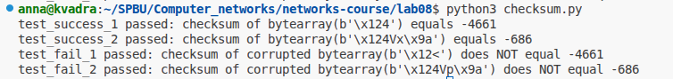

# Практика 8. Транспортный уровень

## Реализация протокола Stop and Wait (8 баллов)
Реализуйте свой протокол надежной передачи данных типа Stop and Wait на основе ненадежного
транспортного протокола UDP. В вашем протоколе, реализованном на прикладном уровне,
отправитель отправляет пакет (frame) с данными, а затем ожидает подтверждения перед
продолжением.

**Клиент**
- отправляет пакет и ожидает подтверждение ACK от сервера в течение заданного времени (тайм-аута)
- если ACK не получен, пакет отправляется снова
- все пакеты имеют номер (0 или 1) на случай, если один из них потерян

**Сервер**
- ожидает пакеты, отправляет ACK, когда пакет получен
- отправленный ACK должен иметь тот же номер, что и полученный пакет

Вы можете использовать схему, которая была рассмотрена на лекции в рамках обсуждения
протокола rdt3.0, как пример:

### А. Общие требования (5 баллов)
- В качестве базового протокола используйте UDP. Поддержите имитацию 30% потери
  пакетов. Потеря может происходить в обоих направлениях (от клиента серверу и от
  сервера клиенту).
- Должен быть поддержан настраиваемый таймаут.
- Должна быть обработка ошибок (как на сервере, так и на клиенте).
- В качестве демонстрации работоспособности вашего решения передайте через свой
  протокол файл (от клиента на сервер), разбив его на несколько пакетов перед отправкой
  на стороне клиента и собрав из отдельных пакетов в единый файл на стороне сервера.
  Файл и размеры пакетов выберите самостоятельно.

Приложите скриншоты, подтверждающие работоспособность программы.

#### Демонстрация работы
todo

### Б. Дуплексная передача (2 балла)
Поддержите возможность пересылки данных в обоих направлениях: как от клиента к серверу, так и
наоборот. 

Продемонстрируйте передачу файла от сервера клиенту.

#### Демонстрация работы
todo

### В. Контрольные суммы (1 балл)
UDP реализует механизм контрольных сумм при передаче данных. Однако предположим, что
этого нет. Реализуйте и интегрируйте в протокол свой способ проверки корректности данных
на прикладном уровне (для этого вы можете использовать результаты из следующего задания
«Контрольные суммы»).

## Контрольные суммы (2 балла)
Методы, основанные на использовании контрольных сумм, обрабатывают $d$ разрядов данных как
последовательность $k$-разрядных целых чисел.
Наиболее простой метод заключается в простом суммировании этих $k$-разрядных целых чисел и
использовании полученной суммы в качестве битов определения ошибок. Так работает алгоритм
вычисления контрольной суммы, принятый в Интернете, — байты данных группируются в $16$-
разрядные целые числа и суммируются. Затем от суммы берется обратное значение (дополнение
до $1$), которое и помещается в заголовок сегмента.

Получатель проверяет контрольную сумму, складывая все числа из данных (включая контрольную
сумму), и сравнивает результат с числом, все разряды которого равны $1$. Если хотя бы один из
разрядов результата равен $0$, это означает, что произошла ошибка.
В протоколах TCP и UDP контрольная сумма вычисляется по всем полям (включая поля заголовка и
данных).

Реализуйте функцию для подсчета контрольной суммы, а также функцию для проверки, что
данные соответствуют контрольной сумме.

**Требования**
- Функция 1 принимает на вход массив байт и возвращает контрольную сумму (число).
- Функция 2 принимает на вход массив байт и контрольную сумму и проверяет,
соответствует ли сумма переданным данным. Размер входного массива ограничен сверху
числом байтов ($= L$), однако данные могут поступать разной длины ($\le L$).

Добавьте два-три теста, покрывающих как случаи
корректной работы, так и случаи ошибки в данных (сбой битов). Вы можете не использовать
тестовые фреймворки и реализовать тестовые сценарии в консольном приложении.

#### Решение
Код решения находится в файле checksum.py. Демонстрация тестов:  

## Задачи

### Задача 1 (2 балла)
Пусть $T$ (измеряется в RTT) обозначает интервал времени, который TCP-соединение тратит на
увеличение размера окна перегрузки с $\frac{W}{2}$ до $W$, где $W$ – это максимальный размер окна
перегрузки. Докажите, что $T$ – это функция от средней пропускной способности TCP.

#### Решение
Будем считать, что размер окна измеряется в байтах.  
Так как размер окна увеличивается линейно, его средний размер равен $W_{avg} = \dfrac{\dfrac{W}{2} + W}{2} = \dfrac{3W}{4}$ (байт)  
Пусть за каждый RTT окно увеличивается на $N$ байт. Тогда время его увеличения с $\frac{W}{2}$ байт до $W$ байт равно $T = \dfrac{W - \dfrac{W}{2}}{N} = \dfrac{W}{2N}$. Отсюда $W = 2NT$  
Средняя пропускная способность равна $R_{avg} = \dfrac{W_{avg}}{RTT} \dfrac{байт}{сек} = \dfrac{3W}{4RTT} \dfrac{байт}{сек} = \dfrac{3 \cdot 2NT}{4RTT} \dfrac{байт}{сек} = \dfrac{3NT}{2RTT} \dfrac{байт}{сек}$  
Отсюда $T = \dfrac{2R_{avg} \cdot RTT}{3N}$  
Так как N и RTT - это константы, то $T$ является функцией от $R_{avg}$, что и требовалось доказать.  

### Задача 2 (3 балла)
Рассмотрим задержку, полученную в фазе медленного старта TCP. Рассмотрим клиент и веб-сервер, напрямую соединенные одним каналом со скоростью передачи данных $R$.
Предположим, клиент хочет получить от сервера объект, размер которого точно равен $15 \cdot S$,
где $S$ – это максимальный размер сегмента.
Игнорируя заголовки протокола, определите время извлечения объекта (общее время
задержки), включая время на установление TCP-соединения (предполагается, что RTT - константа), если:
1. $\dfrac{4S}{R} > \dfrac{S}{R} + RTT > \dfrac{2S}{R}$
2. $\dfrac{𝑆}{𝑅} + 𝑅𝑇𝑇 > \dfrac{4𝑆}{𝑅}$
3. $\dfrac{𝑆}{𝑅} > 𝑅𝑇𝑇$

#### Решение
Объект будет отправлен в 4 окнах (окна по 1, 2, 4 и 8 пакетов соответственно).
Вначале подсчитаем время, которое будет учитываться в каждом из трех случаев одинаково.  
Время на трехэтапное рукопожатие и отправку запроса от клиента серверу равно $1.5 \cdot RTT$ (syn, syn-ack, syn+запрос).  
Время на отправку сервером всех сегментов равно $15 \cdot \dfrac{S}{R}$.  
Время, за которое до клиента дойдет последний сегмент после того, как сервер отправит его в канал, равно $0.5 \cdot RTT$.
Т.о., если не считать простоев сервера между окнами в ожидании ACK от клиента, время операций равно $T_{base} = 1.5 \cdot RTT + 15 \cdot \dfrac{S}{R} + 0.5 \cdot RTT = 2 \cdot RTT + 15 \cdot \dfrac{S}{R}$    
В зависимости от соотношения времени отправки данных в канал сервером ($\dfrac{S}{R}$) и времени задержки отправки пакета и ACK ($RTT$) cервер будет либо простаивать между окнами (если не получен ACK ни на один пакет из последнего отправленного окна), либо не простаивать, а сразу отправлять данные из следующего окна (так как каждый полученный ACK позволяет серверу тут же отправить еще 2 пакета). После последнего окна (в котором 8 пакетов) простоя в любом случае нет (так как в этот момент серверу уже нечего отправлять). После первого окна простой длительностью в RTT будет в любом случае, так как данные начинают идти по каналу только после того, как сервер отправил их туда. Рассмотрим, какие будут простои после окон №2 (2 пакета) и №3 (4 пакета) в каждом из случаев из условия.
1. Заменим неравенство на равносильное:  
$\dfrac{3S}{R} > RTT > \dfrac{S}{R}$  
Так как $RTT > \dfrac{S}{R}$, сервер будет простаивать в течение RTT после отправки окна №2. Так как $\dfrac{3S}{R} > RTT$, то после окна №3 простоя не будет. Итого имеем простои после окон №1 и №2 и общее время доставки объекта клиенту равно:  
$T = T_{base} + 2 \cdot RTT = 4 \cdot RTT + 15 \cdot \dfrac{S}{R}$  
2. Заменим неравенство на равносильное:  
$𝑅𝑇𝑇 > \dfrac{3𝑆}{𝑅}$  
Здесь простои сервера в худшем случае будут и после окна №2, и после окна №3 (я рассматриваю худший случай, потому что если $𝑅𝑇𝑇 \le \dfrac{4𝑆}{𝑅}$, то простоя после 3-го окна не будет, но по условию этого не дано). Т.о., в результате простоя после певых трех окон общее время будет равно:  
$T = T_{base} + 3 \cdot RTT = 5 \cdot RTT + 15 \cdot \dfrac{S}{R}$  
3. В этом случае сервер будет простаивать только после окна №1, так как к моменту отправки в канал очередного пакета уже придет ACK на предыдущий пакет, и сервер сможет отправлять сразу два следующих пакета без простоев. Итоговое время для этого случая равно:  
$T = T_{base} + 1 \cdot RTT = 3 \cdot RTT + 15 \cdot \dfrac{S}{R}$  

### Задача 3 (2 балла)
Рассмотрим модификацию алгоритма управления перегрузкой протокола TCP. Вместо
аддитивного увеличения, мы можем использовать мультипликативное увеличение. TCP-отправитель увеличивает размер своего окна в $(1 + a)$ раз (где $a$ - небольшая положительная
константа: $0 < a < 1$), как только получает верный ACK-пакет.
Найдите функциональную зависимость между частотой потерь $L$ и максимальным размером окна
перегрузки $W$. Утверждается, что для этого измененного протокола TCP, независимо от средней
пропускной способности TCP-соединения всегда требуется одинаковое количество времени для
увеличения размера окна перегрузки с $\frac{W}{2}$ до $W$.

#### Решение
Рассмотрим количество пакетов, отправленное в каждом раунде (т.е. за один RTT) при увеличении размера окна  с $\frac{W}{2}$ до $W$:
Раунд 0: $n_0 = \dfrac{W}{2}$  
Раунд 1: $n_1 = (1 + a) \cdot \dfrac{W}{2}$  
Раунд 2: $n_2 = (1 + a)^2 \cdot \dfrac{W}{2}$  
...  
Раунд T: $n_T = (1 + a)^T \cdot \dfrac{W}{2} = W$

Общее число пакетов, отправленных за одну итерацию цикла увеличения окна с $\frac{W}{2}$ до $W$ равно:  
$N = n_0 + n_1 + n_2 + ... + n_T = \dfrac{W}{2} \cdot ((1 + a) + (1 + a)^2 + ... (1 + a)^T) = \dfrac{W}{2} \cdot \dfrac{(1 + a)^{(T + 1)} - 1}{a}$  

Из формулы для $n_T$ найдем $T$:  
$(1 + a)^T \cdot \dfrac{W}{2} = W => (1 + a)^T = 2 => T = log_{1 + a}(2)$  

Тогда $N = \dfrac{W}{2} \cdot \dfrac{2a + 1}{a} = \dfrac{(2a + 1)W}{2a}$.  

Частота потерь равна $L = \dfrac{1}{N}$.  
Подставив в это выражение найденное ранее значение $N$, получим зависимость $L$ от $W$:  
$L = \dfrac{2a}{(2a + 1)W}$  

### Задача 4. Расслоение TCP (2 балла)
Для облачных сервисов, таких как поисковые системы, электронная почта и социальные сети,
желательно обеспечить малое время отклика если конечная система расположена далеко от датацентра, то значение RTT будет большим, что может привести к неудовлетворительному времени
отклика, связанному с этапом медленного старта протокола TCP.
Рассмотрим задержку получения ответа на поисковый запрос. Обычно серверу требуется три окна
TCP на этапе медленного старта для доставки ответа. Таким образом, время с момента, когда
конечная система инициировала TCP-соединение, до времени, когда она получила последний
пакет в ответ, составляет примерно $4$ RTT (один RTT для установления TCP-соединения, плюс три
RTT для трех окон данных) плюс время обработки в дата-центре. Такие RTT задержки могут
привести к заметно замедленной выдаче результатов поиска для многих запросов. Более того,
могут присутствовать также и значительные потери пакетов в сетях доступа, приводящие к
повторной передаче TCP и еще большим задержкам.

Один из способов смягчения этой проблемы и улучшения восприятия пользователем
производительности заключается в том, чтобы:
- развернуть внешние серверы ближе к пользователям
- использовать расслоение TCP путем разделения TCP-соединения на внешнем сервере.
При расслоении клиент устанавливает TCP-соединение с ближайшим внешним сервером, который
поддерживает постоянное TCP-соединение с дата-центром с очень большим окном перегрузки TCP.

При использовании такого подхода время отклика примерно равно:
$$4 \cdot RTT_{FE} + RTT_{BE} + \text{ время обработки}~~~~~~~(1)$$
где $RTT_{FE}$ — время оборота между клиентом и внешним сервером, и $RTT_{BE}$ — время оборота
между внешним сервером и дата-центром (внутренним сервером). Если внешний сервер закрыт
для клиента, то это время ответа приближается к $RTT$ плюс время обработки, поскольку значение
$RTT_{FE}$ ничтожно мало и значение $RTT_{BE}$ приблизительно равно $RTT$. В итоге расслоение TCP
может уменьшить сетевую задержку, грубо говоря, с $4 \cdot RTT$ до $RTT$, значительно повышая
субъективную производительность, особенно для пользователей, которые расположены далеко
от ближайшего дата-центра.

Расслоение TCP также помогает сократить задержку повторной передачи TCP, вызванную
потерями в сетях.

Докажите утверждение $(1)$. 

#### Решение
При использовании схемы с промежуточным сервером $FE$ последовательность действий будет такая:  
1. Отправка клиентом серверу $FE$ SYN-пакета, получение от него ACK-пакета (занимает время $RTT_{FE}$)  
2. Отправка клиентом серверу $FE$ запроса данных (занимает время $0.5 \cdot RTT_{FE}$)  
3. Отправка от сервера $FE$ серверу $BE$ запроса данных (занимает время $0.5 \cdot RTT_{BE}$)
4. Обработка данных на сервере $BE$
5. Получение всех данных сервером $FE$ от сервера $BE$ в одном окне (т.к. окно между серверами большое) (занимает время $0.5 \cdot RTT_{BE}$)  
6. Отправка данных от сервера $FE$ клиенту в трех отдельных окнах, с получением ACK после первого и второго окна (после третьего тоже будет ACK, но он не входит в промеждуток времени, в течение которого клиент ожидает данные) (занимает время $2.5 \cdot RTT_{FE}$)  

Просуммировав время, указанное в пунктах 1-6, получим формулу (1):  
$4 \cdot RTT_{FE} + RTT_{BE} + \text{ время обработки}$
