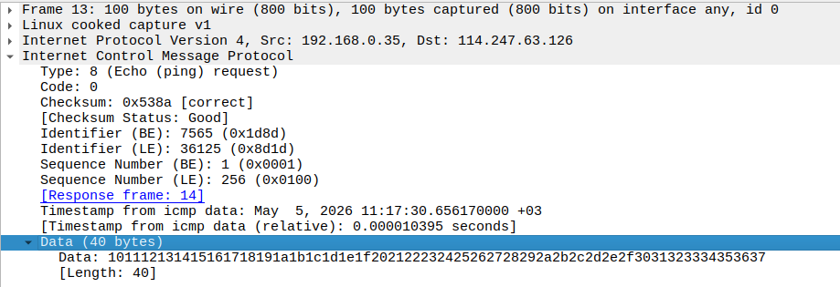
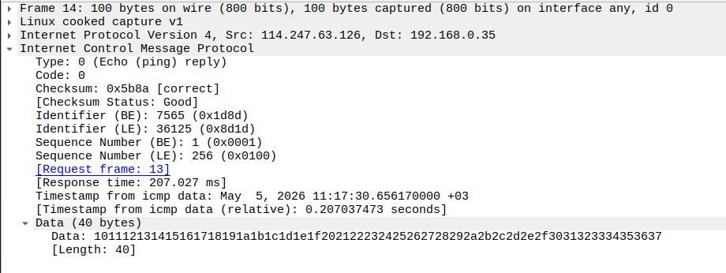
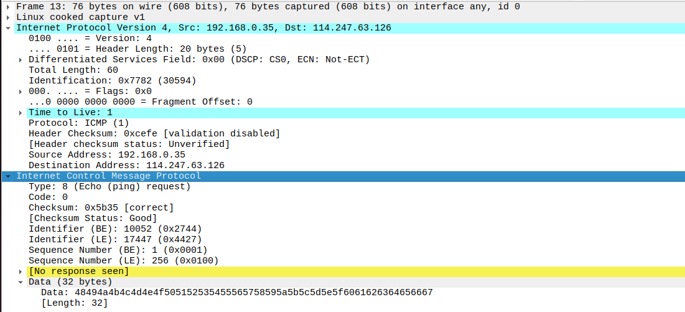
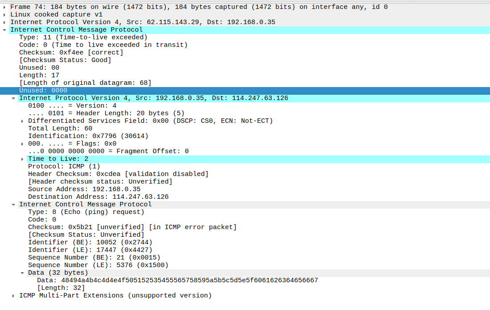
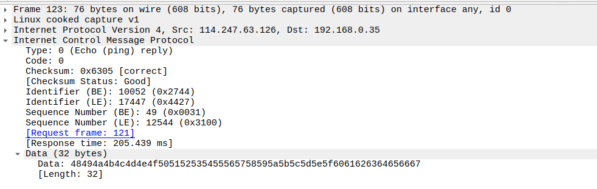
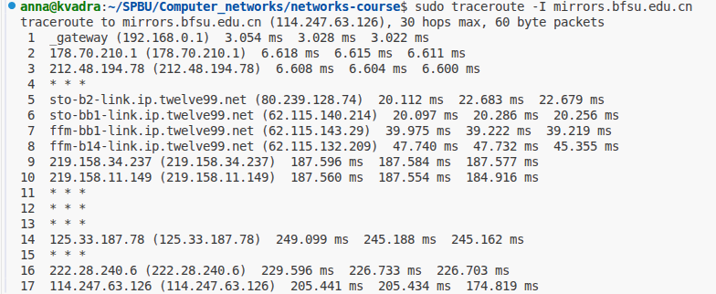
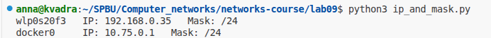
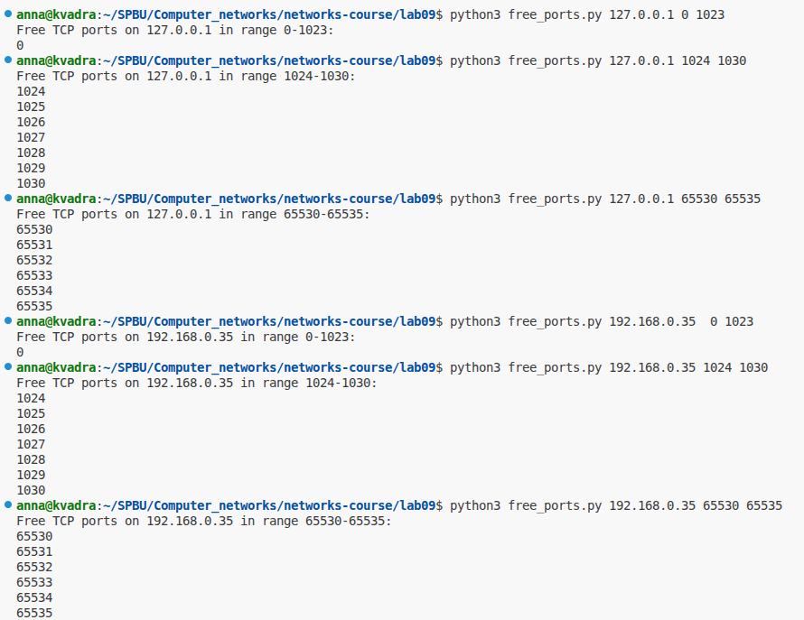

# Практика 9. Сетевой уровень

## Wireshark: ICMP
В лабораторной работе предлагается исследовать ряд аспектов протокола ICMP:
- ICMP-сообщения, генерируемые программой Ping
- ICMP-сообщения, генерируемые программой Traceroute
- Формат и содержимое ICMP-сообщения

### 1. Ping (4 балла)
Программа Ping на исходном хосте посылает пакет на целевой IP-адрес; если хост с этим адресом
активен, то программа Ping на нем откликается, отсылая ответный пакет хосту, инициировавшему
связь. Оба этих пакета Ping передаются по протоколу ICMP.

Выберите какой-либо хост, расположенный на другом континенте (например, в Америке или
Азии). Захватите с помощью Wireshark ICMP пакеты от утилиты ping.
Для этого из командной строки запустите команду (аргумент `-n 10` означает, что должно быть
отослано 10 ping-сообщений): `ping –n 10 host_name`

Для анализа пакетов в Wireshark введите строку icmp в области фильтрации вывода.

#### Вопросы
1. Каков IP-адрес вашего хоста? Каков IP-адрес хоста назначения?
   - IP-адрес моего хоста 192.168.0.35
   - IP-адрес хоста назначения 114.247.63.126
2. Почему ICMP-пакет не обладает номерами исходного и конечного портов?
   - Потому что ICMP - это протокол сетевого уровня, а порты используются на транспортном уровне. ICMP передает данные между хостами (для проверки их доступности и т.п.), а не между слушающими порты приложениями.
3. Рассмотрите один из ping-запросов, отправленных вашим хостом. Каковы ICMP-тип и кодовый
   номер этого пакета? Какие еще поля есть в этом ICMP-пакете? Сколько байт приходится на поля 
   контрольной суммы, порядкового номера и идентификатора?
   - У пакета запроса Type 8 и Code 0
   - Есть еще поля Checksum, Identifier, Sequence Number, Timestamp from icmp data, Data
   - Каждое из полей Checksum, Identifier, Sequence Number занимает два байта.  
     
4. Рассмотрите соответствующий ping-пакет, полученный в ответ на предыдущий. 
   Каковы ICMP-тип и кодовый номер этого пакета? Какие еще поля есть в этом ICMP-пакете? 
   Сколько байт приходится на поля контрольной суммы, порядкового номера и идентификатора?
   - У пакета ответа Type 0 и Code 0
   - Также есть поля Checksum, Identifier, Sequence Number, Timestamp from icmp data, Data
   - По два байта на каждое из полей Checksum, Identifier, Sequence Number  
     

### 2. Traceroute (4 балла)
Программа Traceroute может применяться для определения пути, по которому пакет попал с
исходного на конечный хост.

Traceroute отсылает первый пакет со значением TTL = 1, второй – с TTL = 2 и т.д. Каждый
маршрутизатор понижает TTL-значение пакета, когда пакет проходит через этот маршрутизатор.
Когда на маршрутизатор приходит пакет со значением TTL = 1, этот маршрутизатор отправляет
обратно к источнику ICMP-пакет, свидетельствующий об ошибке.

Задача – захватить ICMP пакеты, инициированные программой traceroute, в сниффере Wireshark.
В ОС Windows вы можете запустить: `tracert host_name`

Выберите хост, который **расположен на другом континенте**.

#### Вопросы
1. Рассмотрите ICMP-пакет с эхо-запросом на вашем скриншоте. Отличается ли он от ICMP-пакетов
   с ping-запросами из Задания 1 (Ping)? Если да – то как?
   - Сам ICMP-пакет не отличается, но отличается IP-дейтаграмма, в которой он пересылался: теперь TTL в ней равен 1, 2, 3,... (в зависимости от номера пакета), а не 64, как было при ping.  
     
2. Рассмотрите на вашем скриншоте ICMP-пакет с сообщением об ошибке. В нем больше полей,
   чем в ICMP-пакете с эхо-запросом. Какая информация содержится в этих дополнительных полях?
   - Добавилось 4-байтовое поле Unused, содержащее нули. Оно необходимо для выравнивания, так как сообщение об ошибке не содержит полей Identifier и Sequence Number. Помимо этого в сообщении об ошибке содержатся заголовки исходных отправленных IP и ICMP-пакетов, на которых произошла ошибка.  
     
3. Рассмотрите три последних ICMP-пакета, полученных исходным хостом. Чем эти пакеты
   отличаются от ICMP-пакетов, сообщающих об ошибках? Чем объясняются такие отличия?
   - Последние три полученные пакета имеют структуру, аналогичную структуре пакета-запроса, у них Type 0 и Code 0, и они не содерждат копии исходного IP и ICMP заголовков.
   - Эти отличия объясняются тем, что последние три полученные пакета -- это обычные успешные ICMP-ответы. Они были отправлены с конечного хоста, на который делался запрос через traceroute, а не с промежуточных маршрутизаторов, как в случае предыдущих сообщений об ошибках. Получив эти сообщения, traceroute завершил работу. Сообщения три, а не одно, потому что traceroute отправляет по три эхо-запроса для каждого значения TTL.  
     
4. Есть ли такой канал, задержка в котором существенно превышает среднее значение? Можете
   ли вы, опираясь на имена маршрутизаторов, определить местоположение двух маршрутизаторов,
   расположенных на обоих концах этого канала?
   - Да, есть. До 8-го маршрутизатора (в порядке, в котором их посещал traceroute) задержка не превышала 48 мс, а при пинге 9-го маршрутизатора она увеличилась до 187 мс.
   - Маршрутизатор, который оказался 8-м на пути моего пакета, вероятно, расположен во Франкфурте-на-Майне (т.к. его имя начинается с ffm). Скорее всего, это маршрутизатор глобального Интернет-провайдера. 9-й маршрутизатор не имеет имени в выводе traceroute, но судя по большой задержке, он расположен в Китае, куда и направлялся мой запрос.  
     

## Программирование.

### 1. IP-адрес и маска сети (1 балл)
Напишите консольное приложение, которое выведет IP-адрес вашего компьютера и маску сети на консоль.

#### Демонстрация работы
Код находится в файле ip_and_mask.py. Программа выводит IP-адреса и маску для каждого сетевого интерфейса (кроме loopback)  
  

### 2. Доступные порты (2 балла)
Выведите все доступные (свободные) порты в указанном диапазоне для заданного IP-адреса. 
IP-адрес и диапазон портов должны передаваться в виде входных параметров.

#### Демонстрация работы
Код находится в файле free_ports.py.  
  

### 3. Широковещательная рассылка для подсчета копий приложения (6 баллов)
Разработать приложение, подсчитывающее количество копий себя, запущенных в локальной сети.
Приложение должно использовать набор сообщений, чтобы информировать другие приложения
о своем состоянии. После запуска приложение должно рассылать широковещательное сообщение
о том, что оно было запущено. Получив сообщение о запуске другого приложения, оно должно
сообщать этому приложению о том, что оно работает. Перед завершением работы приложение
должно информировать все известные приложения о том, что оно завершает работу. На экран
должен выводиться список IP адресов компьютеров (с указанием портов), на которых приложение
запущено.

Приложение считает другое приложение запущенным, если в течение промежутка времени,
равного нескольким интервалам между рассылками широковещательных сообщений, от него
пришло сообщение.

**Такое приложение может быть использовано, например, при наличии ограничения на
количество лицензионных копий программ.*

Пример GUI:

#### Демонстрация работы
todo

## Задачи. Работа протокола TCP

### Задача 1. Докажите формулы (3 балла)
Пусть за период времени, в который изменяется скорость соединения с $\frac{W}{2 \cdot RTT}$
до $\frac{W}{RTT}$, только один пакет был потерян (очень близко к концу периода).
1. Докажите, что частота потери $L$ (доля потерянных пакетов) равна
   $$L = \dfrac{1}{\frac{3}{8} W^2 + \frac{3}{4} W}$$
2. Используйте выше полученный результат, чтобы доказать, что, если частота потерь равна
   $L$, то средняя скорость приблизительно равна
   $$\approx \dfrac{1.22 \cdot MSS}{RTT \cdot \sqrt{L}}$$

#### Решение
todo

### Задача 2. Найдите функциональную зависимость (3 балла)
Рассмотрим модификацию алгоритма управления перегрузкой протокола TCP. Вместо
аддитивного увеличения, мы можем использовать мультипликативное увеличение. 
TCP-отправитель увеличивает размер своего окна в небольшую положительную 
константу $a$ ($a > 1$), как только получает верный ACK-пакет.
1. Найдите функциональную зависимость между частотой потерь $L$ и максимальным
размером окна перегрузки $W$.
2. Докажите, что для этого измененного протокола TCP, независимо от средней пропускной
способности, TCP-соединение всегда требуется одинаковое количество времени для
увеличения размера окна перегрузки с $\frac{W}{2}$ до $W$.

#### Решение
todo
